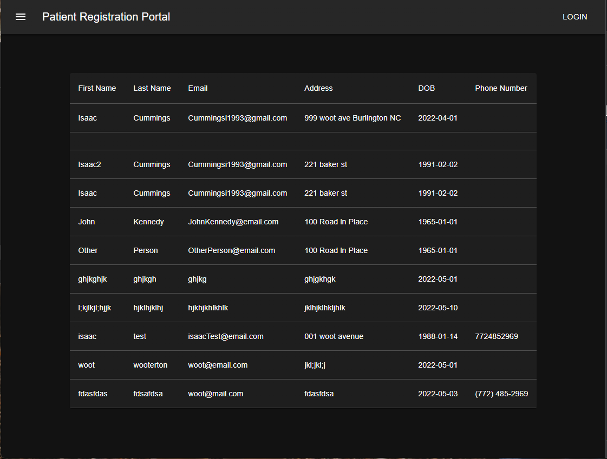

# donefirst_demo

## Instructions for starting

- `docker-compose up --build`

## Configure Couchbase
- Unfortunately i didnt spend the time automating the couchbase setup so this part will have to be done manually. 
- Navigate to 'localhost:8091'
  - Click 'Setup New Cluster' 
  - Fill out cluster information 
    - Cluster Name: donefirst_demo
    - Username: Administrator
    - Password: Password
  - Accept Terms 
  - Save and finish 
  - Add Bucket 
    - Bucket Name: patient_registration
    - Save 
  - Click 'Query' 
    - Paste this primary index in the query editor and click 'Execute' : ```CREATE PRIMARY INDEX `#primary` ON `patient_registration```

## Navigate to the web app
- Navigate to 'localhost:5200'
- The sandwich icon in the top right will take you to the registration or administration pages 
- Registration: 
- Admin: 

## Notes

- I wouldnt do this in a production system, but for ease of showcasing i included the couchbase database in the checked in files. You should have a full functioning system including database and some existing data just from running the docker build.
